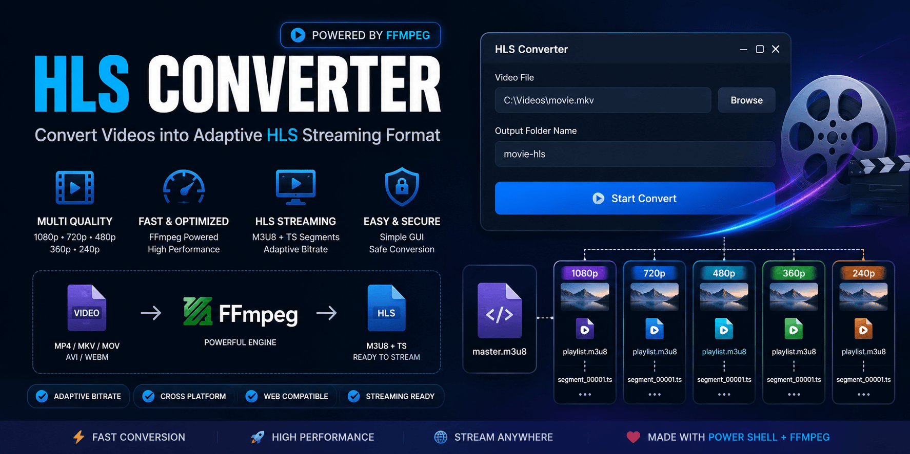

# 🎬 HLS Converter

<p align="center">
  
</p>

<p align="center">
  <b>Convert Videos into Adaptive HLS Streaming Format ⚡</b>
</p>

<h1 align="center">HLS Converter</h1>

<p align="center">
  <b>Encode • Stream • Deliver 🎥</b><br>
  Developed with ❤️ using PowerShell + FFmpeg
</p>

---

# 🚀 Overview

**HLS Converter** is a Windows-based GUI video conversion tool that converts normal video files into **HTTP Live Streaming (HLS)** format.

It creates multiple video qualities automatically:

- 1080p
- 720p
- 480p
- 360p
- 240p

with adaptive streaming support using:

- Master Playlist (`master.m3u8`)
- Quality Playlists
- Video Segments (`.ts`)

Perfect for:

- Video streaming websites
- Personal media servers
- OTT platforms
- Movie streaming projects


---

# ✨ Features


## 🎥 Video Processing

* MKV Support
* MP4 Support
* MOV Support
* AVI Support
* WEBM Support
* Multi Quality Encoding
* H.264 Compression
* AAC Audio Encoding


## ⚡ HLS Streaming

* Automatic HLS Generation
* Adaptive Bitrate Streaming
* Master Playlist Creation
* Segment Based Streaming
* Browser Compatible Output


## 🖥️ GUI Application

* Simple Windows Interface
* File Browser
* Custom Output Folder
* One Click Conversion
* No Command Line Required


## 🚀 Performance

* FFmpeg Powered
* Optimized Encoding
* Multiple Resolution Output
* Fast Media Delivery


---

# 🧠 How It Works


1. Select your video file

2. Choose output folder name

3. Click:

```
Start Convert
```

4. FFmpeg processes the video

5. HLS files are generated

6. Play using:

- VLC
- hls.js
- Video.js
- Web Players


---

# ⚡ Quick Start


## Clone Repository


```bash
git clone https://github.com/AmitDas4321/HLS-Converter.git

cd HLS-Converter
```


---

## Requirements


### Windows

Windows 10/11


### Install FFmpeg


Download:

https://ffmpeg.org/download.html

OR


Install FFmpeg using command:


```powershell
winget install Gyan.FFmpeg
```

Check installation:

```powershell
ffmpeg -version
```


---

# ▶️ Run Application


Run PowerShell:


```powershell
powershell -ExecutionPolicy Bypass -File HLS-Converter.ps1
```


The GUI window will open.


---

# 🎬 Output Example


Input:


```
movie.mkv
```


Output:


```
movie-hls

│
├── master.m3u8
│
├── 0
│   ├── playlist.m3u8
│   └── segment_00001.ts
│
├── 1
│   ├── playlist.m3u8
│   └── segment_00001.ts
│
├── 2
│   ├── playlist.m3u8
│   └── segment_00001.ts
│
├── 3
│   ├── playlist.m3u8
│   └── segment_00001.ts
│
└── 4
    ├── playlist.m3u8
    └── segment_00001.ts

```


---

# 🎞️ Quality Profiles


| Quality | Resolution | Bitrate |
|---|---|---|
| 1080p | 1920x1080 | 5000 kbps |
| 720p | 1280x720 | 2500 kbps |
| 480p | 854x480 | 1200 kbps |
| 360p | 640x360 | 700 kbps |
| 240p | 426x240 | 400 kbps |


---

# 🏗️ Technology


## Application

* PowerShell
* Windows Forms


## Video Engine

* FFmpeg


## Streaming Format

* HLS
* M3U8
* MPEG-TS


---

# 📁 Project Structure


```txt
HLS-Converter

│
├── HLS-Converter.ps1
│
├── banner.png
│
├── preview.png
│
└── README.md

```


---

# 🌐 Test Streaming


Start local server:


```powershell
python -m http.server 8080
```


Open:


```
http://localhost:8080/master.m3u8
```


Example:


```
http://localhost:8080/movie-hls/master.m3u8
```


---

# 🔌 Player Example


Using hls.js:


```html
<video id="video" controls></video>

<script src="https://cdn.jsdelivr.net/npm/hls.js"></script>

<script>

const video = document.getElementById("video");

const hls = new Hls();

hls.loadSource(
"master.m3u8"
);

hls.attachMedia(video);

</script>
```


---

# ⚙️ FFmpeg Configuration


Video:

```
Codec: H.264
Profile: Main
Pixel Format: yuv420p
```


Audio:

```
Codec: AAC
Bitrate: 128kbps
```


HLS:

```
Segment Duration: 6 seconds
Playlist Type: VOD
```


---

# ⚠️ Notes


* FFmpeg must be installed
* Conversion time depends on hardware
* Large movies require more storage
* GPU encoding can improve speed


---

# 🚀 Future Improvements


* NVIDIA GPU Encoding
* Drag & Drop Support
* Progress Bar
* Queue Conversion
* Automatic Server Upload
* Web Dashboard


---

# 📜 License


MIT License © 2026


---

<p align="center">
  <b>Made with ❤️ by <a href="https://amitdas.site">Amit Das</a></b><br>
  🍿 Bringing couples together through movies.
</p>